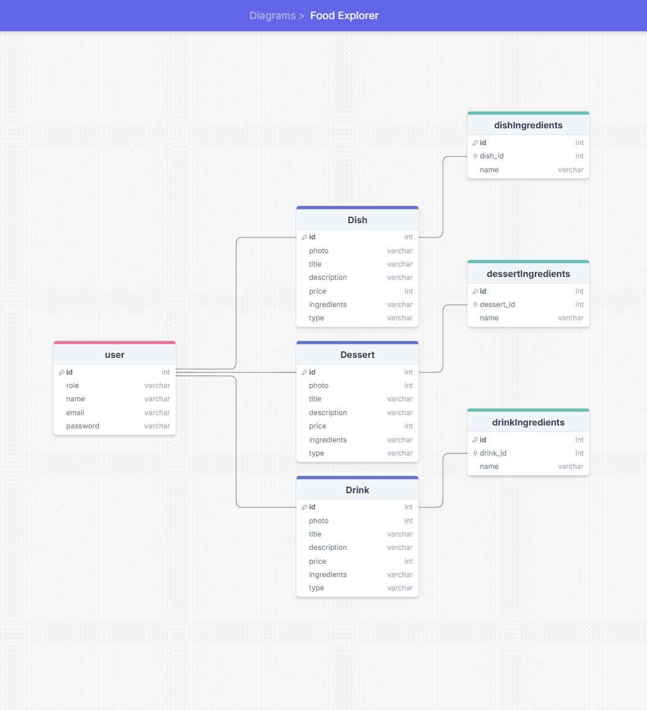

# 🍽️ FOOD EXPLORER

Food Explorer is a food application where administrators can create, edit and delete dishes. They will be separated into meals, desserts and drinks, and users will be able to create an account on the application and will have access to the entire repertoire of a restaurant and select their dish and finally place their order.

⚠️ **Attention! This is the back-end of the application, follow the steps below to configure it** 

## 🤖 PROTOTYPE




## 📒 FEATURES

 - Using Node to Development
 - Express to routing and handle app
 - Multer to handle files
 - Knex to handle database
 - SQLite3 to database
 - jsonwebtoken to pass around requests
 - Routing
 - CRUD


## 🛠️ Run the Project


* Before the commands to install the app, I recommend install the latest version of [Node](https://nodejs.org/) in your machine and [VsCode](https://code.visualstudio.com/) in your compute to execute the commands in your integrate terminal.

### ⚒️ Configuration

* To install the node module package, run the code bellow: 

```bash
    npm install
```
* After install node module, to run the project check if the backend is running on port 3000 by checking on **server.js** file: 
```bash
    http://localhost:3000
```

* Then, run the command bellow to migrate tables to database: 
```bash
    npm run migrate
```

* Finally, to run the backend run the next command: 
```bash
    npm run dev
```
## 🚀 License

**[@devnestali]('https://github.com/devnestali') - Software Engineering and FullStack Developer**


All rights reserved by **[devnestali]('https://github.com/devnestali')** and **[rocketseat]('https://www.rocketseat.com.br/')**

**I HOPE YOU ENJOY** 😀
